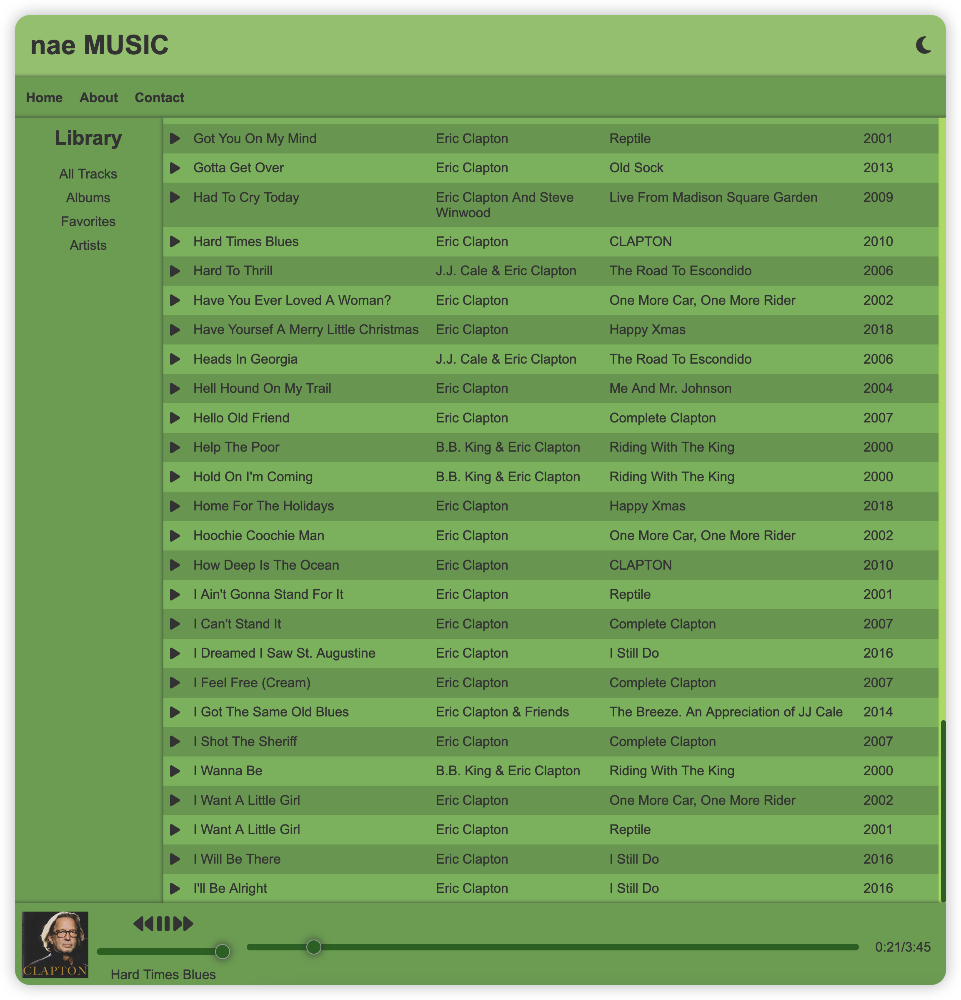
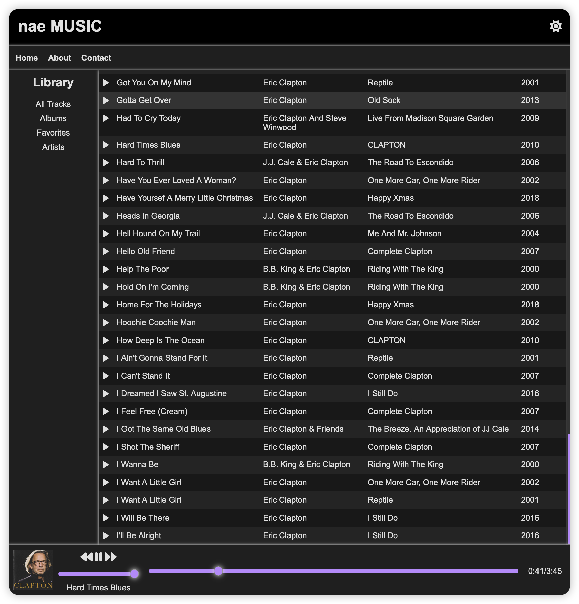

# nae (under development)

A simple music organizer.

Organize and backup the musics in different device.

Max 30 min per day.

## WebUI

Now, there is a simple WebUI for nae.

- The nae color theme
  
- The dark color theme
  

## Basic usage

Because this package us under development, the following script is only for debug testing.

- check the media in `test_media` : `nae check --path test_media`
- import the media in `test_media`: `nae import --path test_media --keep_original_file True`
- run a server: `nae serve`

## Motivation

- [`beets`](https://beets.readthedocs.io/en/stable/) is nice, but
  - it does not use relative path
  - there is some rules I can not understand.
  - I do not need the auto-tagging, I am used to manually completing the tags
- I enjoy the processes of developing the package.
- I also want to learn and practice the programming skills.

## Supported format

- [x] mp3
- [x] flac

## Develop principles

- The music library can be transport, synchronized easily in different place.

- Multi-artist should be dealt with.

## Music library principles

- Every file should be tagged completely, the tags should include
  - title
  - album
  - artist
  - album artist
  - genre
  - data
  - album picture

## About nae

color `#86C166`

## develop logs and TODOs

- [x] upload to github
- [x] write the motivation
- [x] find a package to get the tag of music: [`mutagen`](https://mutagen.readthedocs.io/en/latest/index.html)
- [x] complete the tags handler
  - [x] define a class to save the tags obtain from `mutagen`
  - [x] handle the case when tags are not complete
  - [ ] handle the multi-artist splitted by `/`
- [ ] complete the database
  - [ ] add a table to save the info of database, such as `BASE_DIR`
  - [ ] handle playlist
- [ ] complete the WebUI
  - [x] add the `flac` format support
  - [ ] make the play button better
  - [ ] add a album page
- [ ] complete the logging system
  - [x] add logging system
  - [ ] color the log message
- [ ] complete the file handler
  - [x] move files when import media
  - [x] check the file which are not `flac` or `mp3`, log these files
  - [ ] make incremental backups when importing media
  - [x] handle the case for repeated media
- [ ] complete the `default_config`
  - [x] add the `default_config`
  - [x] use user's config to overwrite the default config
  - [ ] use `dataclass` and `pydantic`
- [ ] write the documentation
- [ ] publish to pypi
- [x] add the command UI
- [ ] complete the command UI

## Acknowledge

- [`mutagen`](https://mutagen.readthedocs.io/en/latest/index.html)
- [`FastAPI`](https://fastapi.tiangolo.com/)
- [`HOWLER.JS`](https://howlerjs.com/)
- [`SQLAlchemy`](https://www.sqlalchemy.org/)
- [`Font Awesome`](https://fontawesome.com/)